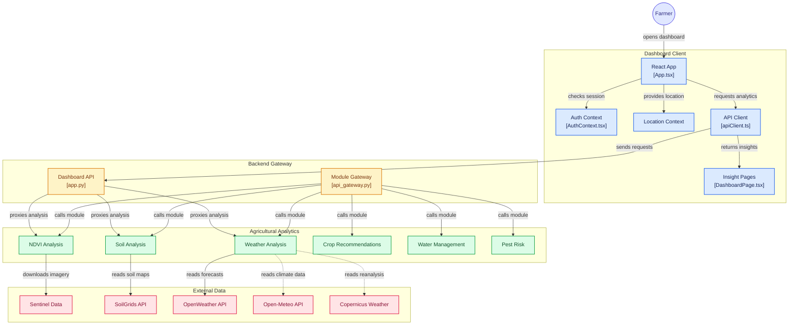

# 🌾 CropEye — Predictive GIS Platform for Precision Agriculture

**CropEye** is a full-stack precision-agriculture platform that transforms satellite imagery, soil information, weather data, and agricultural models into location-specific insights for farmers.

Instead of presenting environmental datasets independently, CropEye brings **vegetation health, soil conditions, weather, crop recommendations, irrigation requirements, and pest risk** together through a unified dashboard and modular analytics backend.

---

## 🌱 Project Overview

Modern agriculture generates and depends on information from multiple sources: satellite imagery, soil databases, weather services, climate datasets, and field observations.

The challenge is turning these disconnected datasets into information that farmers can actually use.

CropEye addresses this by providing a GIS-oriented agricultural intelligence platform where a farmer's location becomes the input for multiple analytical modules.

The system can provide insights across:

- 🛰️ Vegetation health using NDVI
- 🌱 Soil properties and fertility
- 🌦️ Current and forecast weather
- 🌾 Crop suitability
- 💧 Irrigation and water requirements
- 🐛 Pest and disease risk

CropEye uses a modular architecture so that individual agricultural models and external data providers can evolve independently while still being accessed through one dashboard.

---

## ✨ Key Features

### 🛰️ NDVI & Vegetation Health Analysis

CropEye processes multispectral satellite information to estimate vegetation health using the **Normalized Difference Vegetation Index (NDVI)**.

Sentinel-2 imagery provides the spectral information required for vegetation analysis:

```text
NDVI = (NIR - Red) / (NIR + Red)
```

The module uses:

- Sentinel-2 Level-2A imagery
- Band 8 — Near Infrared
- Band 4 — Red
- Location-based satellite retrieval
- Vegetation-health classification
- Historical trend analysis

This allows vegetation conditions and possible crop-stress areas to be examined spatially.

---

### 🌱 Soil Analysis

The soil module retrieves location-specific soil information using **SoilGrids** and combines it with agricultural analysis.

Analysed parameters can include:

- Soil pH
- Organic carbon
- Nitrogen
- Phosphorus
- Potassium
- Soil texture
- Fertility indicators

Soil information can also be correlated with vegetation-health data to provide more meaningful agricultural recommendations.

---

### 🌦️ Weather Intelligence

CropEye combines multiple meteorological sources to provide both short-term agricultural weather information and broader climate context.

Supported sources include:

- OpenWeather
- Open-Meteo
- Copernicus climate/reanalysis data

Weather parameters include:

- Temperature
- Humidity
- Precipitation
- Wind speed
- Solar/weather-related conditions

Agricultural analysis can additionally derive indicators such as:

- Growing Degree Days (GDD)
- Frost risk
- Heat-stress risk
- Historical weather trends

---

### 🌾 Crop Recommendations

CropEye combines environmental conditions from multiple modules to evaluate crop suitability.

Inputs can include:

```text
Soil Properties
      +
Weather Conditions
      +
Vegetation Health
      ↓
Crop Suitability Analysis
      ↓
Crop Recommendations
```

The recommendation module uses multi-factor environmental information rather than relying on a single parameter.

---

### 💧 Water Management

The water-management module estimates crop water requirements using soil and weather conditions.

It supports:

- Reference evapotranspiration analysis
- Penman–Monteith ET₀ calculation
- Crop-specific water requirements
- Irrigation scheduling
- Water-stress assessment

This provides a foundation for data-driven irrigation decisions.

---

### 🐛 Pest & Disease Risk

CropEye evaluates environmental conditions associated with pest and disease development.

Inputs such as:

- Temperature
- Humidity
- Crop type

are used to generate risk assessments and agricultural management recommendations.

---

## 🏗️ System Architecture

CropEye follows a modular architecture consisting of four primary layers:

**Dashboard Client → Backend Gateway → Agricultural Analytics → External Data Providers**



> **Tip:** The architecture diagram is interactive when viewed on GitHub. Several components link directly to their corresponding implementation files.

---

## 🔄 How CropEye Works

A typical CropEye request follows this flow:

```text
Farmer
   ↓
React Dashboard
   ↓
Location Context
   ↓
Frontend API Client
   ↓
Python Backend Gateway
   ↓
Agricultural Analytics Module
   ↓
External Environmental Data
   ↓
Analysis / Calculation
   ↓
Dashboard Insight
```

### 1. Farmer opens the dashboard

The React application provides the main interface for interacting with CropEye.

### 2. Authentication and location context are established

`AuthContext.tsx` manages authentication/session-related state while the location context provides geographic information required by the analytical modules.

### 3. Dashboard requests agricultural intelligence

The frontend API client sends requests to the Python backend based on the selected analysis.

### 4. Backend routes the request

The backend application and GIS module gateway coordinate requests to the appropriate agricultural-analysis service.

### 5. The selected module performs its analysis

Depending on the request, CropEye invokes:

```text
NDVI
Soil
Weather
Crop Recommendation
Water Management
or
Pest Risk
```

### 6. External environmental information is retrieved

Individual modules communicate with their required data providers.

For example:

```text
NDVI    → Sentinel-2
Soil    → SoilGrids
Weather → OpenWeather / Open-Meteo / Copernicus
```

### 7. Results return to the dashboard

Processed agricultural information is returned through the backend and API client to the dashboard for presentation to the farmer.

---

## 🧩 Agricultural Analytics Modules

| Module | Purpose | Primary Inputs |
|---|---|---|
| 🛰️ NDVI | Vegetation-health analysis | Sentinel-2 imagery |
| 🌱 Soil | Soil-property and fertility analysis | SoilGrids + location |
| 🌦️ Weather | Weather and agricultural climate indicators | Weather/climate APIs |
| 🌾 Crop | Crop-suitability recommendations | Soil + weather + NDVI |
| 💧 Water | Irrigation and water-requirement analysis | Weather + soil + crop |
| 🐛 Pest | Pest and disease risk assessment | Temperature + humidity + crop |

The modular design keeps each analytical domain logically separated while allowing information from multiple modules to contribute to higher-level recommendations.

---

## 🔌 API Modules

### 🛰️ NDVI Analysis

**Service:** Port `5001`

```http
POST /api/ndvi/analyze
```

Processes latitude and longitude information to perform location-specific vegetation analysis.

Primary external source:

**Copernicus Sentinel-2**

---

### 🌱 Soil Analysis

**Service:** Port `5002`

```http
POST /api/soil/analyze
```

Retrieves and analyses soil properties for a geographic location and can correlate them with vegetation information.

Primary external source:

**ISRIC SoilGrids**

---

### 🌦️ Weather Analysis

**Service:** Port `5003`

```http
GET /api/weather/current
GET /api/weather/agricultural
```

Provides weather information and farming-specific environmental indicators.

Data sources include:

- OpenWeather
- Open-Meteo
- Copernicus climate/reanalysis data

---

### 🌾 Crop Recommendation

**Service:** Port `5004`

```http
POST /api/crop/recommend
```

Combines environmental parameters to produce crop-suitability recommendations.

---

### 💧 Water Management

**Service:** Port `5005`

```http
POST /api/water/calculate
```

Uses weather, soil, crop type, and growth-stage information for irrigation and water-management calculations.

---

### 🐛 Pest & Disease Assessment

**Service:** Port `5006`

```http
POST /api/pests/assess
```

Evaluates environmental conditions to estimate pest and disease risk.

---

## 🌐 External Data Integrations

### Copernicus Sentinel-2

Used for multispectral vegetation analysis and NDVI calculation.

```text
Sentinel-2 Level-2A
Band 8 (NIR)
Band 4 (Red)
        ↓
      NDVI
```

### ISRIC SoilGrids

Provides global soil-property information used by the soil-analysis module.

### OpenWeather

Provides current and forecast meteorological information used for weather and agricultural calculations.

### Open-Meteo

Provides additional meteorological and historical weather information.

### Copernicus Climate Data

Provides climate and reanalysis information that can support longer-term agricultural environmental analysis.

---

## 🧰 Technology Stack

| Layer | Technology |
|---|---|
| Frontend | React |
| Frontend Language | TypeScript / TSX |
| Backend | Python |
| API Services | Flask-based services |
| GIS / Raster Analysis | Python geospatial processing |
| Satellite Data | Copernicus Sentinel-2 |
| Soil Data | ISRIC SoilGrids |
| Weather Data | OpenWeather |
| Additional Weather | Open-Meteo |
| Climate / Reanalysis | Copernicus |
| Styling | Tailwind CSS |
| Deployment Configuration | Render |
| Version Control | Git & GitHub |

---

## 📂 Project Structure

```text
CropEye/
│
├── frontend/
│   └── src/
│       ├── App.tsx
│       │
│       ├── context/
│       │   ├── AuthContext.tsx
│       │   └── LocationContext.tsx
│       │
│       ├── services/
│       │   └── apiClient.ts
│       │
│       └── pages/
│           └── DashboardPage.tsx
│
├── backend/
│   ├── app.py
│   │
│   └── GIS/
│       ├── api_gateway.py
│       │
│       ├── NDVI/
│       │   └── ndvi_flask_backend.py
│       │
│       ├── Soil/
│       │   └── soil_flask_backend.py
│       │
│       ├── Weather/
│       │   └── weather_flask_backend.py
│       │
│       ├── Crop/
│       │   └── crop_flask_backend.py
│       │
│       ├── Water/
│       │   └── water_flask_backend.py
│       │
│       └── Pest/
│           └── pest_flask_backend.py
│
├── requirements.txt
├── render.yaml
├── LICENSE
└── README.md
```

---

## 🛰️ Real & Simulated Data Strategy

CropEye is designed to work with a combination of **open environmental datasets, external APIs, and simulated agricultural data**.

### Real-world/open data

Satellite and environmental services provide location-based information such as:

- Sentinel-2 multispectral imagery
- SoilGrids soil-property maps
- Weather forecasts
- Historical meteorological information
- Climate/reanalysis datasets

### Simulation

Where physical field sensors or drone hardware are unavailable, simulated data can represent agricultural measurements and demonstrate the data-processing workflow.

This allows the software architecture and analytical pipeline to be developed and evaluated without claiming that physical IoT infrastructure is already deployed.

---

## 🎯 Project Objectives

CropEye aims to demonstrate how GIS and environmental data can be combined to support precision-agriculture decisions.

The project focuses on:

- Converting geospatial data into understandable agricultural insights
- Combining multiple environmental data sources
- Monitoring vegetation health
- Analysing soil conditions
- Providing weather-aware agricultural intelligence
- Supporting crop-selection decisions
- Improving irrigation planning
- Identifying environmental pest and disease risks
- Building a modular platform that can accommodate additional agricultural models and data sources

---

## 🚀 Future Scope

CropEye provides a foundation that can be extended with:

- Live IoT soil-moisture sensors
- In-field weather stations
- Drone imagery ingestion
- Field-boundary management
- Persistent farm and field profiles
- Historical farm analytics
- Automated satellite-scene monitoring
- Push notifications and agricultural alerts
- Machine-learning crop-yield prediction
- Advanced pest and disease models
- Irrigation automation
- Multi-farm management
- Offline/mobile access
- Farmer-specific recommendation history

The modular analytics architecture allows these capabilities to be introduced without tightly coupling them to the dashboard.

---

## 🌍 Why CropEye?

Agricultural decisions rarely depend on a single variable.

Crop health can be affected simultaneously by:

```text
Vegetation Condition
        +
Soil Properties
        +
Weather
        +
Water Availability
        +
Pest Pressure
        ↓
Agricultural Decision
```

CropEye brings these signals into a common analytical workflow.

Rather than functioning as only a weather dashboard or an NDVI viewer, the project demonstrates how **GIS, remote sensing, environmental APIs, and agricultural models can work together as a decision-support platform for precision agriculture.**

---

## ⚠️ Project Scope

CropEye is an academic and prototype precision-agriculture platform.

Analytical outputs and recommendations should be treated as decision-support information rather than a replacement for professional agronomic advice, field inspection, or validated production agricultural systems.

External-data accuracy and availability depend on their respective providers.

---

## 🤝 Contributing

Contributions, suggestions, and improvements are welcome.

Potential contribution areas include:

- GIS processing
- Agricultural modelling
- Remote sensing
- Frontend visualization
- API development
- Weather analytics
- Soil analytics
- Crop recommendation models

Fork the repository, create a feature branch, and submit a pull request with a clear description of the proposed change.

---

## 📄 License

This project is distributed under the **MIT License**.

See the `LICENSE` file for details.

---

## 👨‍💻 Repository

Explore the complete implementation:

**GitHub:** `Simplyaksh18/CropEye`

---

### 🌾 CropEye

**Satellite intelligence. Environmental analytics. Better-informed farming decisions.**
